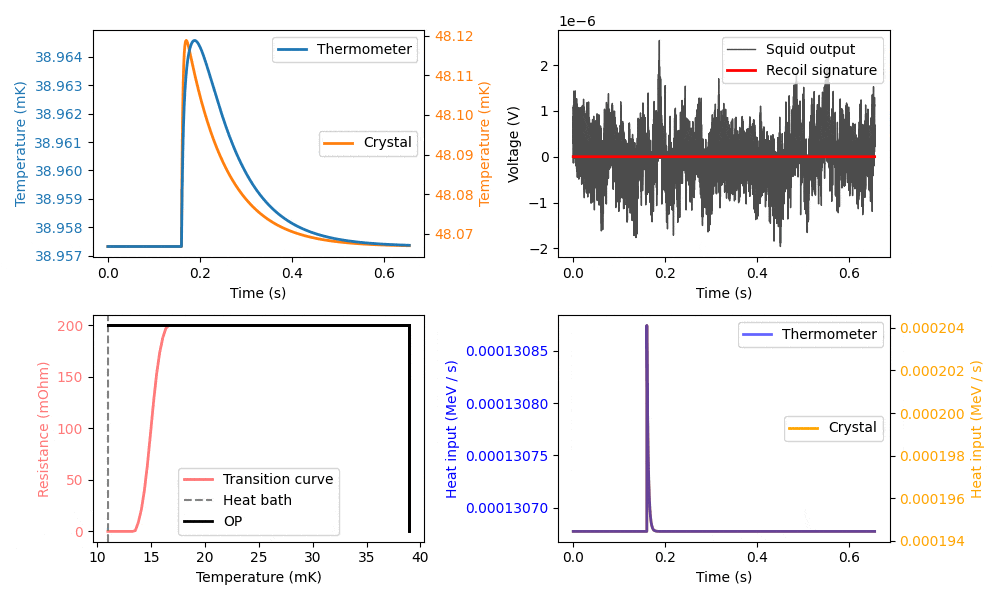

*******************
CryoEnv
*******************

A reinforcement learning environment for detector optimization. Simulation of cryogenic detectors from first principles.

Correspondence to: felix.wagner@oeaw.ac.at

### Usage:

Try the scripts ...

`tests/test_cryosig.py`

`tests/test_cryosweep.py`

.. and for training a SBL3 SAC agent ...

`tests/train_wrapper.py`

`tests/run_wrapper.py`

... most of them have a helper in the command line argument handler.

Test our own implementation of a SAC agent with:

`tests/cryoenv_continuous_v0_sac.py`
